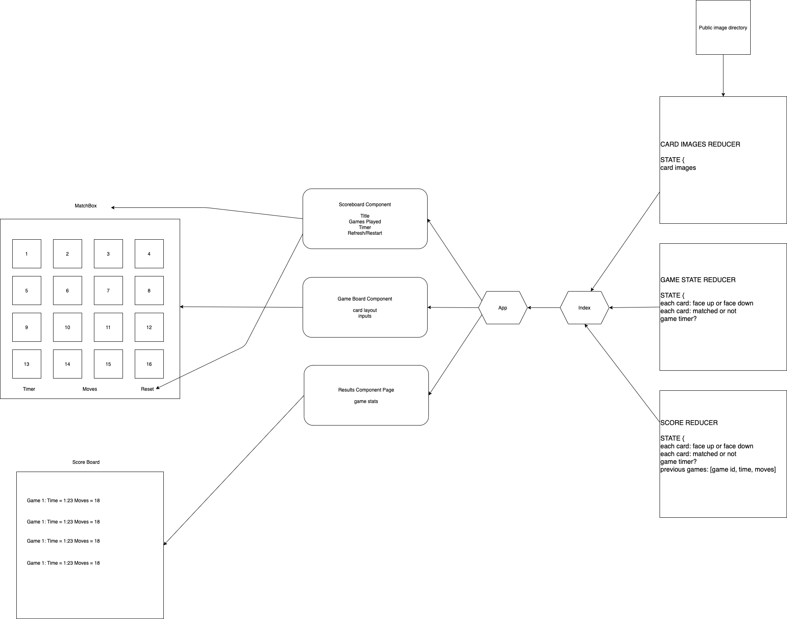

# Code Fellows 401 | Lab 39: Matchbox

## Authors

- Ricardo Barcenas
- Simon Panek
- Nathan Cox

## Description

- Matchbox, an aesthetically pleasing way to kill a couple of minutes, get out of your head, and stay the onset of dementia.
- Play our matching game online and challenge yourself to beat your best time.

## How to Play

- Play [Matchbox](gh-pages) here.
- See the [code](https://github.com/simon-panek/matchbox) here.

## Technology Used

- HTML, CSS, and JavaScript
- The React framework

## Documentation

## Resources and Attributions
